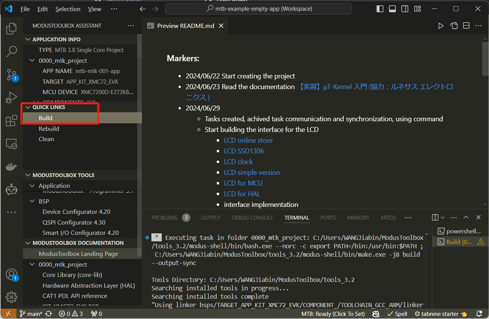

# Clone and Build the project by VScode
- Setup the environment with vscode for ModusToolbox development
    - [VS Code](https://code.visualstudio.com/)
    - Add plugins
        - 
- Clone the project.
- Open the workspace.
    - 

- Choose the workspace file that was cloned
    - 
- The project is open now
    - 
- Go to the ModusToolbox tool <strong>!now the tool is not ready yet!</strong>
    - 
    - 
- Get the ModusToolbox tools    
    - 
- Waiting vscode to install the packages
    - 
- The packages are successfully installed!
    - 
- Build the project
    - 
- Then wait for the building of the project. It takes very long time...
    - 
- After waiting for a while, the project build finished successfully.
    - 
- Open the programmer
    - 
- Program the device
    - 
    - 